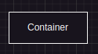
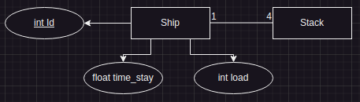
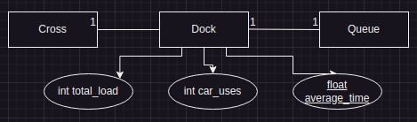
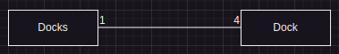
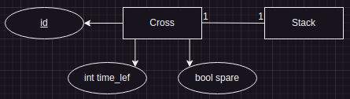
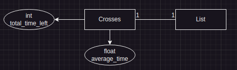
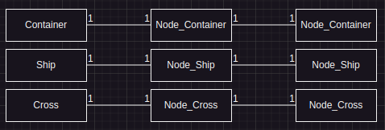
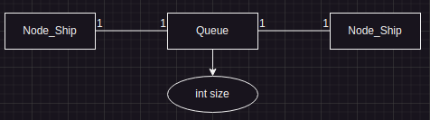
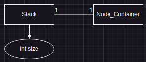
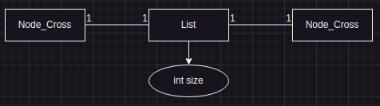

# Introdução

Neste trabalho, o foco principal será a movimentação de navios e contêineres nos terminais de um porto. Para
compreender de forma objetiva as operações portuárias, serão apresentados os principais elementos envolvidos nesse
contexto.

Um terminal de porto é uma área, onde os navios chegam e se posicionam em
filas para a carga (empilhamento) e descarga (desempilhamento) dos contêineres, que são posteriormente transportados
para um pátio de armazenamento. Esses terminais são responsáveis pela troca de contêineres entre navios
porta-contêineres e os diferentes modos de transporte terrestre.

O processo geral de carga e descarga de contêineres pode ser dividido em vários subprocessos. Primeiramente, quando um
navio chega ao porto, gruas são utilizadas para içar os contêineres dos navios. Em
seguida, os contêineres são transferidos das gruas para as travessas. Essas travessas são compostas por
pilhas onde os contêineres são armazenados por determinado período.

No terminal, equipamentos como gruas e veículos straddle carriers desempenham um papel fundamental. Os straddle
carriers são veículos capazes de transportar as travessas. Quando um veículo chega à travessa, ele à desloca para
o pátio, onde, é descarregada a sua carga.

Dessa forma, o modelo de simulação conceitual proposto permitirá explorar e analisar as diversas atividades envolvidas
num porto, desde a chegada do navio até o transporte dos contêineres para o pátio, proporcionando uma compreensão
abrangente das operações portuárias.

- [Propósta](documentation/Trabalho_SimulaPorto_EDI.pdf)
- [Protótipo](documentation/desenho-simulador_portiario.pdf)

# Documentação

Guia abrangente para entendimento do projeto.

[Pular inicialização](#arquitetura-do-projeto)

## Iniciando com o projeto

### Requisitos do sistema

#### Sistema Operacional

O projeto é multi-platform, portanto roda em qualquer sistema operacional. Sejam eles:

- Windows
- Unix/Linux
- MacOs

#### Dependências

- Compilador C
- Make

###                          

### Download

Baixe o projeto rodando o comando:

```bash
git clone https://github.com/Akles-Camoleze/port-simulator.git
```

Ou, baixe o .zip [aqui](https://github.com/Akles-Camoleze/port-simulator/archive/refs/heads/dev-project-structure.zip).

### Execução

O projeto usa a ferramenta *make* para automatizar sua compilação.
Para executá-lo, verifique se está dentro do diretório e rode o comando:

```bash
make
```

Após roda-lo, o projeto será compilado e executado.

## Arquitetura do Projeto

O projeto foi organizado seguindo uma arquitetura simples e modular, com componentes, structs e utils, de modo a
promover a reutilização de código, a organização e a facilidade de manutenção. A seguir, são apresentados os principais
elementos da arquitetura:

### Componentes

Os componentes são módulos ou objetos que encapsulam funcionalidades específicas do sistema. Cada componente é
responsável por uma parte distinta do projeto, o que permite trabalhar de forma isolada em cada uma dessas partes. A
organização em componentes facilita o desenvolvimento, teste e manutenção do código.

### Structs

As structs definem os tipos abstratos de dados (TADs) utilizados no projeto, como pilha, fila, lista e nó. Essas
estruturas fornecem uma forma consistente e bem definida de armazenar e manipular dados. Elas garantem a correta
utilização das estruturas em todo o código, contribuindo para a consistência e a eficiência do programa.

### Utils

O módulo Utils contém funções úteis que podem ser utilizadas em todo o escopo do projeto. Essas funções englobam tarefas
comuns, como manipulação de ‘strings’, cálculos matemáticos, formatação de dados, entre outras. A centralização dessas
funções num único módulo facilita a sua utilização e manutenção em diferentes partes do código.

## Funcionalidades

### Gestão de navios

- Geração
- Descarregamento de carga por unidade de tempo
- Escalonamento para as filas
- Tempo de espera
- Gestão do tamanho das pilhas de containers

### Travessas

- Visualizar situação
- Escalonamento para as docas
- Descarregamento de carga em partes:

    - 3 cargas na primeira unidade de tempo

    - 2 cargas na segunda unidade de tempo
- Disponibilidade de uso

### Docas (Áreas de atracamento)

- Gestão do tamanho
- Média de espera
- Controle para uso das travessas
- Carrinho (responsável por deslocar travessas)
- Grua (responsável por decarregar navios)

### Container

- Carga dos navios e travessas

### Estastísticas

- Tempo médio de espera nas docas
- Tempo médio de espera para uso das travessas
- Tempo de espera de cada travessa
- Tempo de espera de cada navio

## Estrutura de dados

Neste tópico, será exibido diagramas relacionais das estruturas criadas, seguidos de suas possíveis operações.

### Container



- Criar container.

### Navio



- Criar navio
- Receber containers nas pilhas
- Descarregar
- Selecionar pilha de container
- Comparar tamanho da carga
- Definir tempo de espera

### Docas (Áreas de atracamento)





- Inicializar todas
- Recuperar doca com menor tamanho de fila
- Exibir todas
- Içar (Realiza o funcionamento da grua)
- Enviar travessa para transporte
- Recuperar tempo médio de espera

### Travessas





- Inicializar todas
- Selecionar travessa disponível
- Descarregar travessa
- Exibir todas
- Recuperar travessa da doca
- Recuperar tempo médio de espera

### Nodes

Foram definidos diferentes tipos de nós, para trabalhar com as [Structs](#structs). São eles:


Não possui operações diretas.

### Queue



- Criar
- Enfileirar
- Desenfileirar
- Exibir
- Recuperar primeiro elemento

### Stack



- Criar
- Empilhar
- Desempilhar
- Exibir

### Lista



- Criar
- Adicionar
- Exibir

### Utils

- Calcular média
- Gerar número aleatório entre limites
- Verificação de nulo
- Recuperar unidade de tempo

## Algoritmos

Tópico para abordar sobre o funcionamento dos pricipais métodos utilizados no sistema.

### Escalonamento

Algoritmos utilizados para escalonamento dos rescursos

#### Filas (Docas)

As filas são gerenciadas de forma uniforme, garantindo que nenhuma fila seja maior que as outras. Além disso, as filas
das docas são limitadas a um máximo de 20 navios.

#### Travessas

Inicialmente, cada doca é equipada com uma travessa para operações de carga e descarga. Quando a travessa está cheia, é
movida para o pátio pelo carrinho associado à respectiva doca. Após a descarga, as travessas são realocadas
aleatoriamente para as docas, conforme a necessidade. Esse processo contínuo permite que as docas sempre estejam
a trocar de travessas conforme disponibilidade.

#### Geração de containers no navio

As pilhas de contêineres nos navios são preenchidas de forma uniforme, recebendo de 4 a 16 contêineres cada uma. Isso
garante que nenhuma pilha seja maior que as outras. Um aspecto importante a ser destacado é o método utilizado para
realizar esse preenchimento, que possui uma operação com complexidade O(n), permitindo uma geração rápida e uniforme
das pilhas.

### Cálculos de Médias

Algoritmos genéricos que podem ser usados para cálcular qualque uma das médias existentes no sitema. Sejam elas:

- Tempo médio de espera na fila
- Tempo médio de espera das travessas

# Conclusão

Neste trabalho, foi desenvolvido um modelo de simulação conceitual em linguagem C para a movimentação de navios e
contêineres nos terminais de um porto. O objetivo principal foi compreender e apresentar os principais elementos e
processos envolvidos nas operações portuárias, utilizando estruturas de dados como pilhas, filas e listas. A
utilização de estruturas de dados apropriadas possibilitou a gestão eficiente das operações portuárias, garantindo uma
compreensão abrangente de todo o processo.

*EncodedBy: Akles Camoleze*